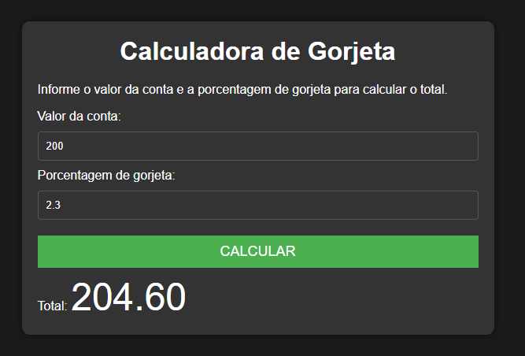

# Calculadora de Gorjeta

Este é um projeto de uma calculadora de gorjeta simples que permite calcular o valor total de uma conta, incluindo a gorjeta, com base no valor da conta e na porcentagem de gorjeta fornecidos. O projeto é desenvolvido utilizando HTML, CSS e JavaScript.

## Funcionalidades

- Insira o valor da conta no campo "Valor da conta".
- Insira a porcentagem de gorjeta desejada no campo "Porcentagem de gorjeta".
- Clique no botão "Calcular" para obter o valor total da conta, incluindo a gorjeta.
- O valor total será exibido abaixo do botão "Calcular".

## Pré-requisitos

Certifique-se de ter os seguintes softwares instalados:

- Navegador da web (Google Chrome, Mozilla Firefox, etc.).

## Instruções de uso

1. Faça o download ou clone este repositório em sua máquina local.
2. Navegue até o diretório do projeto.
3. Abra o arquivo `index.html` em um navegador da web.

## Exemplo de uso

1. Insira o valor da conta no campo "Valor da conta".
2. Insira a porcentagem de gorjeta desejada no campo "Porcentagem de gorjeta".
3. Clique no botão "Calcular".
4. O valor total, incluindo a gorjeta, será exibido abaixo do botão.

## Personalização

Você pode personalizar o projeto de acordo com suas preferências. Aqui estão algumas sugestões:

- Altere o estilo da calculadora modificando o arquivo `style.css`.
- Adicione validações adicionais para garantir que os valores sejam inseridos corretamente.
- Adicione recursos adicionais, como divisão de contas entre várias pessoas ou cálculos personalizados.

## Contribuição

Contribuições são bem-vindas! Se você tiver sugestões, melhorias ou correções, sinta-se à vontade para abrir um problema ou enviar um pull request para este repositório.

---

Se você tiver alguma dúvida ou precisar de mais informações, sinta-se à vontade para entrar em contato.